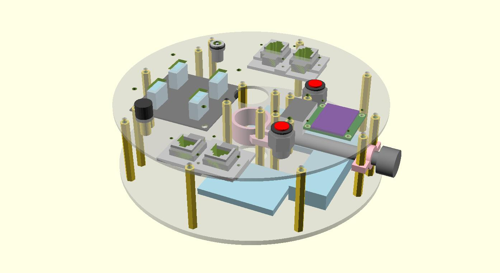

## 简介

eldereal 设计的天文望远镜外设器材，包括硬件图纸和软件代码。

电子邮箱：eldereal@gmail.com

微信号： `eldereal` 

## 赤道仪无线控制器

赤道仪电跟的升级模块。使用廉价的硬件组装，支持WiFi无线控制，支持导星、GOTO，通过ASCOM驱动进行通信，可以直接使用成熟的天文软件控制赤道仪。

[详细说明请点击此链接](./remote-mount/index.md)

## 小型星野赤道仪

Working in progress（70%）

## 天文相机无线控制器

Working in progress（0%）

## 许可证

**eldereal 不对此网站及相关子项目的内容提供任何形式上的保障与保证**

对于本网站的文本、图形和其他非软件类子项目，使用共享创意：署名-相同方式共享4.0协议进行许可。

对于软件类子项目，使用GPLv3协议进行许可。

大体上说，你可以自由的获取、修改、分发这些项目，但需要保证：

 * 署名：您必须给出适当的署名，提供指向本许可协议的链接，同时标明是否（对原始作品）作了修改。您可以用任何合理的方式来署名，但是不得以任何方式暗示许可人为您或您的使用背书。
 * 相同方式共享：如果您再混合、转换或者基于本作品进行创作，您必须基于与原先许可协议相同的许可协议分发您贡献的作品。

详细的许可文本请查看每个项目根目录下的LICENSE文件
