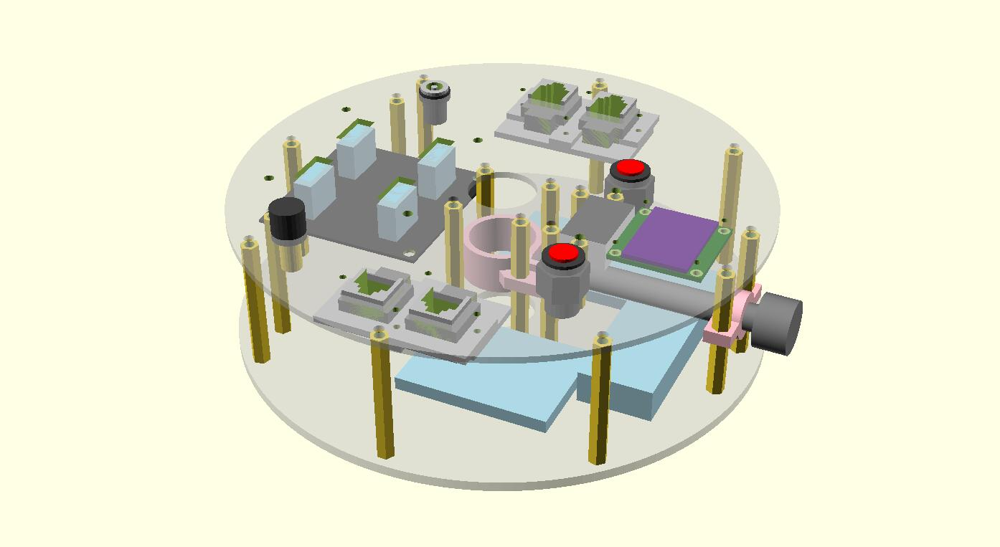

# 赤道仪无线控制器

1. 和电脑连接到同一个 WiFi 热点，即可在电脑上远程控制。热点可以是路由器、手机的网络共享，也可以将电脑自己的无线网卡设置为热点。
2. 支持导星、GOTO。提供 ASCOM 驱动，因此可以直连 PHD Guiding、Maxim DL 等常用软件。
3. 可以安装一个USB Hub，方便连接多个相机、滤镜轮等设备。
4. 控制器和赤道仪重锤大小相似，中间留有孔和锁紧螺丝，可以直接安装在重锤杆上，比较省地方。

## 物料

### 控制电路物料

【两相四线减速步进电机 x 2】电压为6v或12v，并且有合适的安装座可以连接到赤道仪的RA、Dec轴。你需要了解这两台电机的步进角和减速比，以供后面软件配置。如果自己购买请确认该电机的扭矩足够带动赤道仪。

> 我是在信达EQ3D电跟扩展套件的基础上改装的，这两个电机用的是扩展套件中的元件，RA轴未改，Dec轴改动了一下安装座，使其能直连赤道仪，而不是通过齿轮传动，以降低Dec轴的背隙。这两个电机型号相同，步进角为7.5度，减速比为120。

【ESP32开发板】主控电路，支持WiFi

【A4988步进电机驱动板 x 2】控制两台电机

【5v稳压模块】用于将12V供电电压转为控制器使用的5V电压

【0.96寸OLED显示屏】显示系统状态

【直流电压表】如果用电池供电，可以根据电压判断剩余电量。

【5.5/2.1DC电源插座】电源输入

【自锁开关】可以比较方便的切断电源而不用插拔线缆

【RJ12插座 x 2】用于将驱动板和两台电机进行连接

【RJ12电话线 x 2】如果将控制器安装在重锤杆上，50cm长度基本够用，否则根据喜好的安装位置选择线缆长度。

【面包板】我设计中使用了1块85x55mm的，承载主控电路；两块35x47mm的，承载两个步进电机驱动板。

【连接线若干】使用杜邦线或面包板专用连接线，前者更灵活，后者看起来比较整齐好看。

> 以上物料成本（不计两台步进电机，不计邮费）应该在150元左右
>
> 如果自己购买步进电机，加上自制赤道仪连接件，成本应该在160元左右

### 外壳物料（重锤杆安装型）

【M3铜柱双通，50mm x 11】

【M3铜柱单通，23mm x 6】

【M3铜柱双通，23mm x 6】

【M3铜柱双通，10mm x 4】USB Hub 用

【M3螺丝 x 42】

【M8x70mm手拧螺丝】

【亚克力制作面板】

【3D打印制作手拧螺丝座】

> 最贵的是3D打印的螺丝座，大约30-50元，其次是亚克力面板，大约20元、其余螺丝加起来10-20元左右。

### USB Hub

【USB Hub 电路板】

> 这部分只是将一个 USB Hub 固定到了面板上，跟控制器其他部分没有关系。我45元购买了一个方形的 4 口 USB3.0 Hub，将它拆了后取出其中电路板安装在控制器上。

